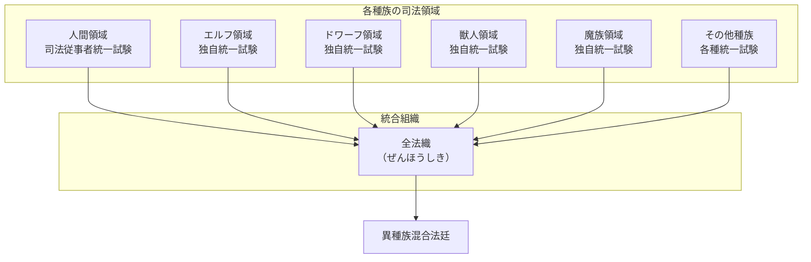

## 第1章：概要

### 1.1 本書の目的

本書は、異種族が共存する世界における司法制度の全体像を体系的に記述した資料である。人間、エルフ、ドワーフ、獣人、魔族、その他あらゆる種族が関わる法廷の仕組み、証明方法、組織構造、そして社会的背景までを網羅する。

---

### 1.2 基本思想

本世界の司法制度は、以下の思想を基盤とする。

|思想|内容|
|---|---|
|日本法の継承|人間領域の法律は日本の法体系を基盤とし、証拠主義・個人責任主義を重視する|
|異種族への拡張|人間法を基礎としつつ、異種族の存在・文化・信仰を法体系に組み込む|
|多元的真実観|「真実」は単一ではなく、複数の証明方法によって多角的に追求される|
|確からしさの原則|裁判は「絶対的真実」ではなく「確からしさ」に基づいて判決を下す|

---

### 1.3 司法制度の全体構造

本世界の司法制度は、各種族の独立した法体系と、それらを統合する上位組織によって構成される。

---

### 1.4 日本法との関係

本世界の人間領域における法律は、日本法を基盤として発展した。ただし、以下の点で大きく異なる。

|項目|日本法|本世界の法|
|---|---|---|
|証明方法|証拠主義のみ|三証明主義（証拠・神託・魔法的真実）|
|適用対象|人間のみ|全種族（種族不問）|
|集団罪|共謀罪・組織犯罪として別途規定|同時多発的に同じ罪を犯した場合に自動成立|
|裁判官|人間のみ|異種族混合|
|最高機関|最高裁判所|全法織|

---

### 1.5 本書で扱う範囲

本書は以下の内容を扱う。

| 章   | 内容             |
| --- | -------------- |
| 第1章 | 概要（本章）         |
| 第2章 | 三証明主義の詳細       |
| 第3章 | 罪と刑罰の体系        |
| 第4章 | 全法織の組織構造       |
| 第5章 | 司法従事者制度        |
| 第6章 | 裁判の流れ          |
| 第7章 | 社会的対立と派閥       |
| 付録A | 用語集            |
| 付録B | FAQ（よくある質問と回答） |

---
