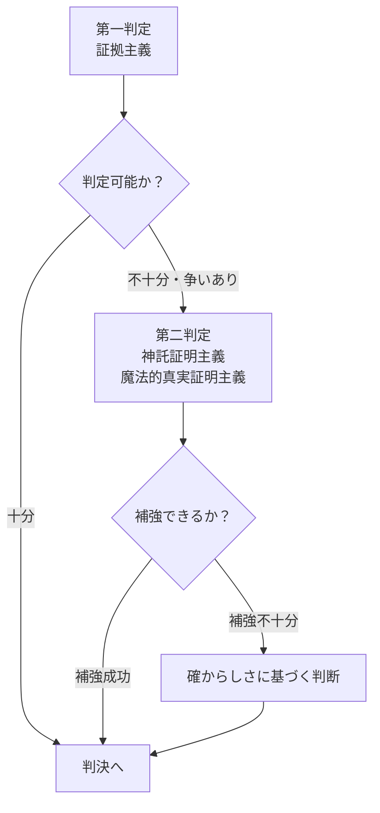
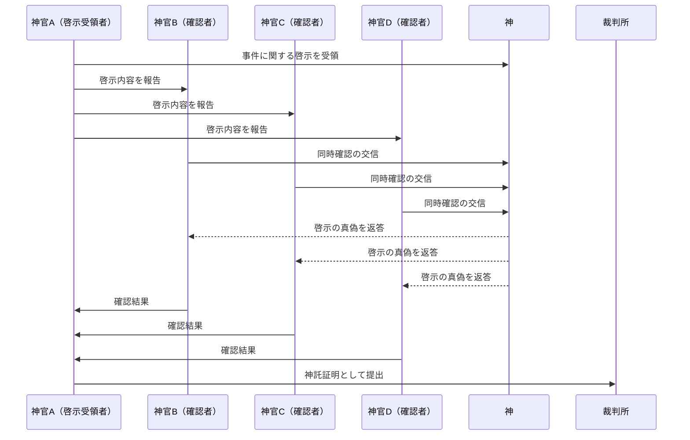
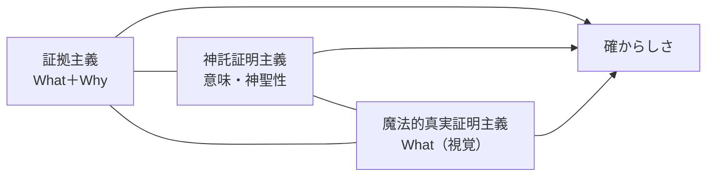

## 第2章：三証明主義

### 2.1 三証明主義とは

本世界の司法制度において、「真実」を追求するための三つの証明方法を総称して**三証明主義**と呼ぶ。いずれの方法も単独では完全ではなく、それぞれの長所と短所を補い合うことで「確からしさ」を高める設計となっている。

|証明主義|正式名称|概要|
|---|---|---|
|証拠主義|物的証拠証明主義|物理的証拠・論理的推論に基づく証明|
|神託証明主義|神聖啓示証明主義|神からの啓示に基づく証明|
|魔法的真実証明主義|魔術的再現証明主義|魔法による現場再現に基づく証明|

---

### 2.2 優先順位

三つの証明主義には明確な優先順位が存在する。

|優先度|証明主義|役割|
|---|---|---|
|基礎|証拠主義|判定の土台。物理的事実を最優先で確認する|
|副次|神託証明主義|証拠主義を補強、または争いがある場合に参照|
|副次|魔法的真実証明主義|証拠主義を補強、または争いがある場合に参照|

**重要原則：** 副次的証明が基礎的証明を覆すには、極めて強力かつ明確な証拠が必要とされる。

---

### 2.3 証拠主義（物的証拠証明主義）

#### 2.3.1 定義

物理的に存在する証拠、目撃証言、記録、論理的推論に基づいて事実を証明する方法。

#### 2.3.2 証拠の種類

|証拠種別|内容|証拠力|
|---|---|---|
|物的証拠|凶器、遺留品、現場の痕跡など|高|
|目撃証言|事件を直接見た者の証言|中〜高|
|状況証拠|直接的ではないが事実を推認させる証拠|中|
|記録・文書|契約書、日記、公的記録など|中〜高|
|自白|被告本人による犯行の告白|高（ただし注意を要する）|

#### 2.3.3 長所と短所

|長所|短所|
|---|---|
|論理的で再現可能性が高い|物証がなければ無力|
|種族・信仰に関係なく適用可能|証拠の捏造リスクがある|
|因果関係を構築できる|目撃証言は記憶違いの可能性がある|

---

### 2.4 神託証明主義（神聖啓示証明主義）

#### 2.4.1 定義

神官またはそれに準ずる職業の者が受けた「神からの啓示」を、複数名の同職者が同時に神へ確認を取ることで証明とする方法。確認者は最低3名を要する。

#### 2.4.2 神託証明の手続き

#### 2.4.3 交信対象となる神の決定

神が複数存在する本世界において、どの神に交信するかは明確なルールで定められている。

|原則|内容|
|---|---|
|被害者基準|犯罪によって被害を受けた者が信奉する神に対して交信する|
|複数被害者の場合|各被害者の信奉する神それぞれに交信を行う|
|無神論者・不可知論者の場合|**神託証明は不可能**。他の証明方法のみで判断する|

#### 2.4.4 長所と短所

|長所|短所|
|---|---|
|超越的な「意味」を付与できる|解釈に幅があり曖昧になりやすい|
|複数確認制度で単独の嘘を排除|神官全員の買収は困難だが不可能ではない|
|物証がない事件でも適用可能|被害者が無神論者の場合は使用不可|
||神同士の意見が割れる可能性（被害者基準で解決）|

---

### 2.5 魔法的真実証明主義（魔術的再現証明主義）

#### 2.5.1 定義

魔法を用いて犯罪現場と同等の状況を再現し、「何が起きたか」を視覚的に証明する方法。

#### 2.5.2 発動条件

|条件|内容|
|---|---|
|現場再現必須|犯罪現場と同等の状況を再現できなければ発動不可|
|場所の確保|現場そのもの、または同等環境の確保が必要|
|術者の存在|有資格の魔法的真実証明術者が必要|

#### 2.5.3 再現できない場合の例

|状況|理由|
|---|---|
|現場が消失（火災、倒壊など）|物理的に再現不可能|
|現場の特定ができない|再現すべき場所が不明|
|極めて特殊な環境（異界、夢の中など）|技術的に再現困難|

#### 2.5.4 長所と短所

|長所|短所|
|---|---|
|「何が起きたか」を視覚的に提示|**論理性がない**（Whyを示せない）|
|直接的で説得力が高い|現場再現が必須という厳しい制約|
|記憶や証言に頼らない|術者の技量に依存する|
||高コストで全件には使用できない|

#### 2.5.5 論理性欠如の問題

魔法的真実証明の最大の弱点は**「What」は示せるが「Why」は示せない**ことである。

|魔法的真実証明で示せること|示せないこと|
|---|---|
|被告がナイフを持っていた|なぜ持っていたか（料理？自衛？殺意？）|
|被告が現場にいた|なぜそこにいたか（偶然？計画？）|
|被害者が倒れた|被告の行為との因果関係|

この欠如を補うために、証拠主義による論理的推論が必要となる。

---

### 2.6 三証明主義の比較総括

|項目|証拠主義|神託証明主義|魔法的真実証明主義|
|---|---|---|---|
|得意|論理的推論、因果関係|超越的意味の付与|「何が起きたか」の視覚化|
|苦手|物証がない場合|曖昧、解釈が分かれる|再現必須、論理性なし|
|使用可否|常に可能|被害者の信仰に依存|現場再現に依存|
|優先度|基礎|副次|副次|
|種族依存|なし|あり（被害者の信仰）|なし|

---

### 2.7 三証明主義の協働

理想的な裁判では、三つの証明が相互に補完し合う。

**例：理想的な証明の組み合わせ**

|段階|証明方法|内容|
|---|---|---|
|1|魔法的真実証明|「被告が被害者を殴った」映像を提示|
|2|証拠主義|凶器の指紋、動機の証拠から因果関係を構築|
|3|神託証明|被害者の神が「この者の行為により我が信徒は傷ついた」と啓示|
|結果|高い確からしさ|三方向から補強された判決|

---
