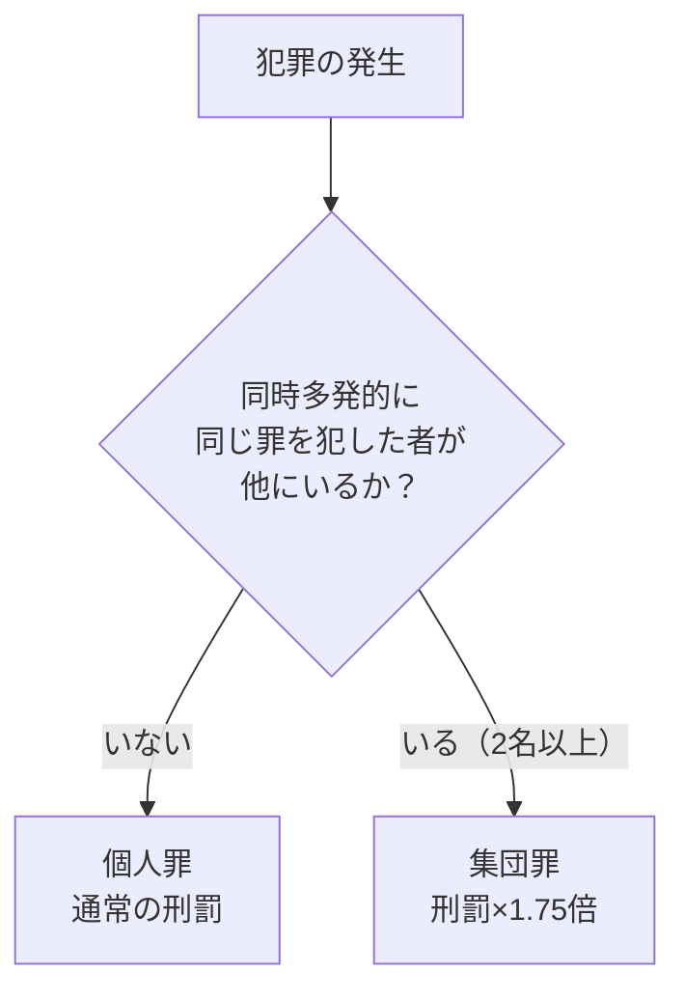
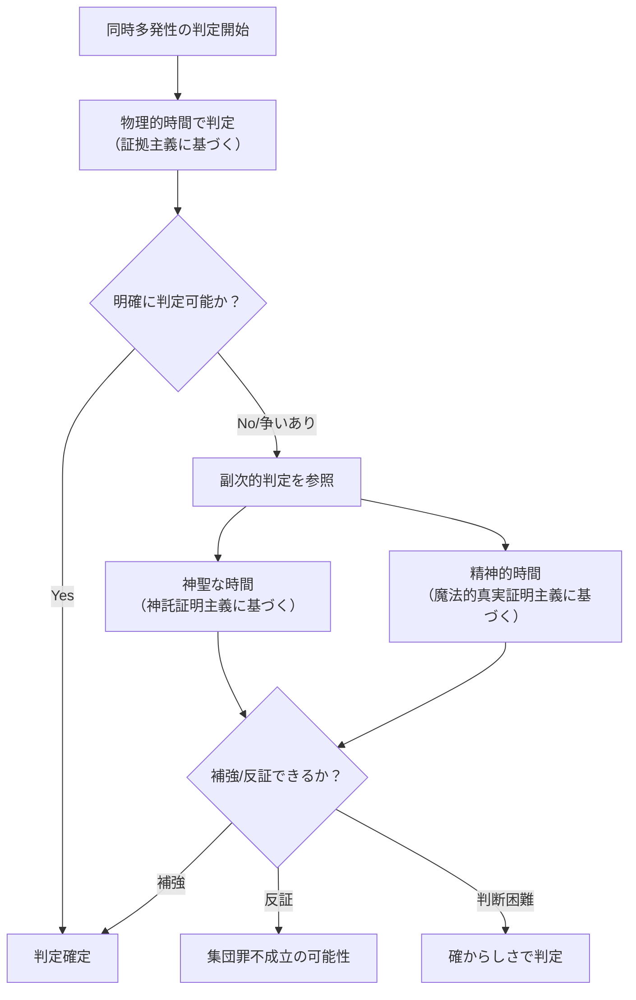
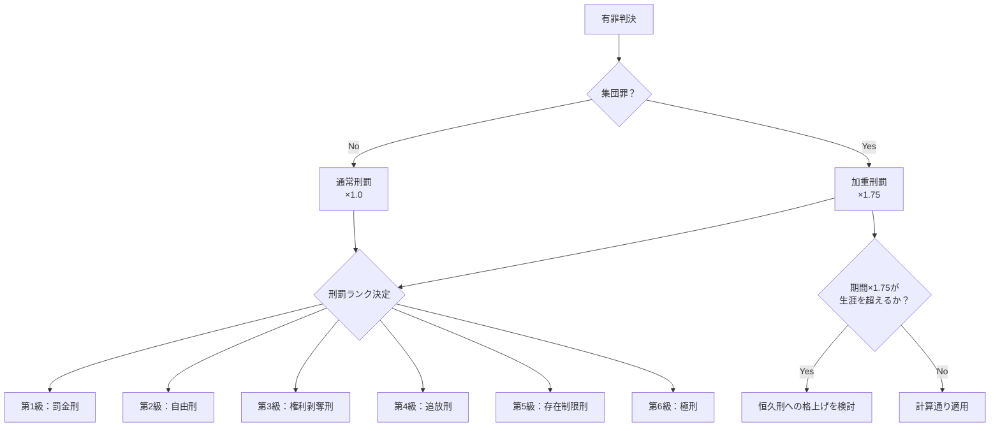
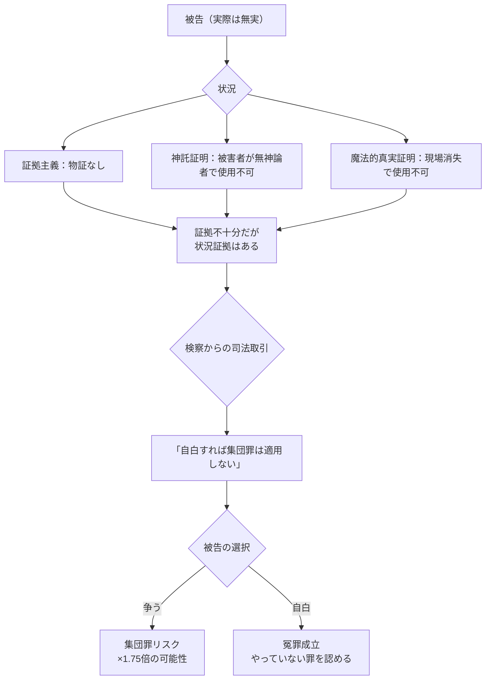
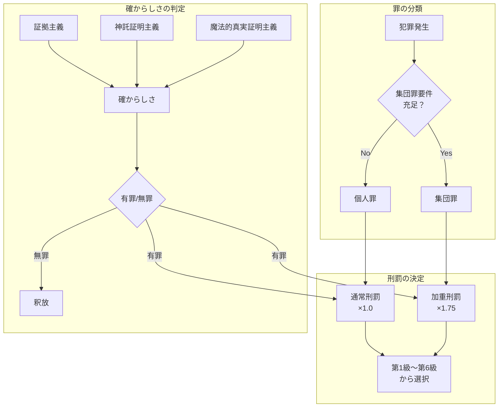

## 第3章：罪と刑罰

### 3.1 基本原則

本世界の刑罰制度は、日本法の個人責任主義を基盤としながら、異種族共存社会特有の概念を組み込んでいる。

|原則|内容|
|---|---|
|個人責任主義|罪は個人に帰属する。種族全体や血縁者に連座しない|
|種族不問|犯罪者・被害者の種族に関わらず、同一の法体系で裁かれる|
|確からしさ基準|絶対的真実ではなく「確からしさ」に基づいて有罪・無罪を判定|
|集団罪制度|同時多発的に同じ罪を犯した場合、刑罰が加重される|

---

### 3.2 罪の分類

#### 3.2.1 個人罪と集団罪

本世界の罪は、大きく**個人罪**と**集団罪**に分類される。

|分類|定義|刑罰|
|---|---|---|
|個人罪|単独で犯した罪、または同時多発性が認められない罪|通常の刑罰（×1.0）|
|集団罪|2名以上が同時多発的に同じ罪を犯した場合|通常の刑罰×1.75倍|

#### 3.2.2 集団罪の成立要件

集団罪が成立するためには、以下の**三要件**を全て満たす必要がある。

|要件|内容|備考|
|---|---|---|
|同一性|同じ罪であること|罪名が一致する必要がある|
|複数性|2名以上が犯していること|種族不問|
|同時多発性|同時期に発生していること|物理的時間を基礎として判定|

**重要：** 意図の共有は**不要**である。面識がなくても、共謀がなくても、結果的に三要件を満たせば集団罪が成立する。

---

### 3.3 集団罪の詳細

#### 3.3.1 同時多発性の判定

「同時多発的」の判定は、三証明主義の優先順位に従って行われる。

|優先度|判定基準|内容|
|---|---|---|
|基礎|物理的時間（証拠主義に基づく）|物証・目撃証言・記録による客観的な時間判定|
|副次|神聖な時間（神託証明主義に基づく）|神託による「神の時間」での同時性判定|
|副次|精神的時間（魔法的真実証明主義に基づく）|魔法的真実証明による動機形成時期の判定|

#### 3.3.2 1.75倍の刑罰係数

集団罪が成立した場合、刑罰は通常の**1.75倍**となる。

|要素|係数|理論的根拠|
|---|---|---|
|個人責任分|×1.0|個人の責任は希釈されない|
|社会的影響加算分|+0.75|同時多発による社会的影響の増大|
|合計|×1.75||

**計算例：**

|罪状|通常刑罰|集団罪の場合|
|---|---|---|
|窃盗|懲役2年|懲役3年6ヶ月（2×1.75）|
|傷害|懲役5年|懲役8年9ヶ月（5×1.75）|
|神木毀損|懲役3年|懲役5年3ヶ月（3×1.75）|

#### 3.3.3 集団罪の適用タイミング

集団罪は**同時多発的に発生した場合のみ**適用される。後から類似の犯罪が発生しても、先に判決を受けた者の刑罰は変更されない。

|ケース|適用|
|---|---|
|AとBが同時期に同じ罪を犯した|両者に集団罪適用|
|Aが罪を犯し、3ヶ月後にBが同じ罪を犯した|各自個人罪として処理|
|Aの裁判中に、同時期のBの犯行が発覚した|両者に集団罪適用|

---

### 3.4 刑罰の体系

#### 3.4.1 刑罰のランク

本世界の刑罰は、軽い順に以下の6段階で構成される。

|ランク|名称|概要|
|---|---|---|
|第1級|罰金刑|金銭による制裁|
|第2級|自由刑|身体的自由の制限|
|第3級|権利剥奪刑|特定の権利・資格の剥奪|
|第4級|追放刑|共同体・領域からの排除|
|第5級|存在制限刑|存在そのものへの制約|
|第6級|極刑|生命の剥奪|

#### 3.4.2 各ランクの共通刑罰

全種族に対して共通に適用される刑罰の定義。

|ランク|共通刑罰|内容|
|---|---|---|
|第1級|罰金|金銭の納付。軽微な犯罪に適用|
|第1級|財産没収|犯罪に関連する財産の没収|
|第2級|懲役|一定期間の拘禁および労務|
|第2級|禁錮|一定期間の拘禁（労務なし）|
|第3級|職業資格剥奪|司法従事者資格、魔法資格などの剥奪|
|第3級|公民権停止|選挙権・被選挙権の一定期間停止|
|第4級|領域追放|特定の種族領域からの追放|
|第4級|全領域追放|全ての種族領域からの追放。放浪を強いられる|
|第5級|魔力封印|魔力を持つ者に対し、魔力の使用を恒久的に封じる|
|第5級|記憶封印|犯罪に関連する知識・技術の記憶を封じる|
|第6級|死刑|生命の剥奪。最も重大な犯罪に対してのみ適用|

#### 3.4.3 種族固有の刑罰

各種族の文化・生態に根ざした固有の刑罰。該当種族の被告にのみ適用されうる。

**人間**

|ランク|固有刑罰|内容|
|---|---|---|
|第3級|戸籍抹消|公的記録からの抹消。社会的に「存在しない者」となる|
|第4級|都市追放|所属する都市・集落からの追放|

**エルフ**

|ランク|固有刑罰|内容|
|---|---|---|
|第3級|森との断絶|森に入ることを禁じられる。エルフにとって精神的に極めて重い|
|第4級|樹名剥奪|誕生時に与えられた樹名（エルフの真名）を剥奪される。共同体との絆の断絶を意味する|
|第5級|長寿封印|エルフの長寿命を封じ、人間と同等の寿命に制限する|

**ドワーフ**

|ランク|固有刑罰|内容|
|---|---|---|
|第3級|鍛造権剥奪|鍛冶・工芸を行う権利の剥奪。ドワーフの存在意義に関わる重刑|
|第4級|坑道追放|地下領域からの追放。地上での生活を強いられる|
|第5級|鉱脈感覚封印|ドワーフ固有の鉱脈を感知する感覚を封じる|

**獣人**

|ランク|固有刑罰|内容|
|---|---|---|
|第3級|群れからの除名|所属する群れ・氏族からの正式な除名|
|第4級|テリトリー喪失|自身のテリトリーに関する全ての権利を失う|
|第5級|本能封印|獣人固有の野生の本能（嗅覚、聴覚の鋭敏さなど）を封じる|

**魔族**

|ランク|固有刑罰|内容|
|---|---|---|
|第3級|契約権剥奪|魔法的契約を結ぶ権利の剥奪。魔族社会での取引が不可能になる|
|第4級|魔界追放|魔族領域からの追放|
|第5級|魔力封印|全魔力の恒久的封印。魔族にとっては存在の根幹を奪われることに等しい|

#### 3.4.4 執行方法の種族別調整

同一の刑罰であっても、種族の生態に応じて執行方法が調整される。

**自由刑（第2級）の調整例**

|種族|調整内容|理由|
|---|---|---|
|人間|通常の拘禁施設|特段の調整なし|
|エルフ|自然光が入る施設、植物の配置|完全な人工環境は精神的崩壊を招くため|
|ドワーフ|地下施設での拘禁|地上への長期拘禁は生態的に不適合|
|獣人|一定の運動空間の確保|身体的活動の完全な制限は健康を著しく害するため|
|魔族|魔力抑制環境下での拘禁|魔力を用いた脱獄防止|

**罰金刑（第1級）の調整例**

|種族|調整内容|理由|
|---|---|---|
|人間|通貨による納付|標準的な執行|
|エルフ|通貨または同等価値の自然資源|通貨経済に完全に組み込まれていない集落が存在するため|
|ドワーフ|通貨または同等価値の鉱物・工芸品|鍛造品を通貨同等に扱う文化的背景|
|獣人|通貨または同等価値の狩猟成果物|通貨を持たない遊牧的集団が存在するため|
|魔族|通貨または同等価値の魔力結晶|魔力結晶が通貨に準じる経済圏が存在するため|

**極刑（第6級）の調整例**

| 種族   | 執行方法                       | 理由                 |
| ---- | -------------------------- | ------------------ |
| 人間   | 薬物投与による安楽死                 | 苦痛の最小化             |
| エルフ  | 大樹の根元での眠りの儀式               | 文化的尊厳の保持           |
| ドワーフ | 鉱山深部への永久封印（封印により生命活動が停止する） | ドワーフの「大地に還る」思想に基づく |
| 獣人   | 荒野での決闘死（希望制）または薬物投与        | 戦士としての尊厳を選択できる     |
| 魔族   | 魔力の完全解放による自己消滅             | 魔族の存在原理に基づく消滅方法    |

#### 3.4.5 集団罪と刑罰ランクの関係

集団罪の1.75倍係数は、以下のように適用される。

|刑罰の種類|1.75倍の適用方法|
|---|---|
|罰金刑|金額を1.75倍にする|
|自由刑（懲役・禁錮）|期間を1.75倍にする|
|権利剥奪刑|剥奪期間を1.75倍にする（恒久剥奪の場合は適用なし）|
|追放刑|追放期間を1.75倍にする（永久追放の場合は適用なし）|
|存在制限刑|封印期間を1.75倍にする（恒久封印の場合は適用なし）|
|極刑|1.75倍の適用なし。極刑は極刑である|

**恒久刑への格上げ：**

|状況|処理|
|---|---|
|期間付き刑罰×1.75が事実上の生涯を超える場合|恒久刑への格上げを検討|
|期間付き権利剥奪×1.75が著しく長期になる場合|裁判官の合議により恒久剥奪に切り替え可能|

#### 3.4.6 刑罰の併科

複数の罪で有罪となった場合、刑罰は併科されうる。

|併科のルール|内容|
|---|---|
|同一ランク内|期間・金額を合算する|
|異なるランク間|それぞれ独立して科す（例：罰金＋懲役）|
|上限|存在制限刑と極刑は併科しない（極刑が優先）|

---

### 3.5 集団罪がもたらす法廷戦略

#### 3.5.1 弁護側の戦略

集団罪の適用を回避するため、弁護側は以下の戦略を取りうる。

|戦略|内容|
|---|---|
|時間差の主張|「依頼人の犯行は他者より後であり、同時多発ではない」|
|罪名の差異化|「依頼人の行為は厳密には異なる罪に該当する」|
|物理的時間の強調|「副次的証明ではなく、物理的時間を基準とすべき」|

#### 3.5.2 検察側の戦略

集団罪の適用を目指す場合、検察側は以下の戦略を取りうる。

|戦略|内容|
|---|---|
|類似案件の捜索|同時期に発生した類似犯罪を積極的に探す|
|神託による同時性主張|「神の時間において、これらは同時である」|
|社会的影響の強調|「同時多発的な犯罪であり、社会秩序への脅威である」|

---

### 3.6 司法取引と冤罪

#### 3.6.1 司法取引の存在

本世界には司法取引が存在する。検察と被告の間で、罪の認否や刑罰について交渉が行われることがある。

|司法取引の例|内容|
|---|---|
|集団罪回避|「自白すれば集団罪の適用を見送り、個人罪（×1.0）で処理する」|
|刑罰軽減|「共犯者の情報を提供すれば、刑罰を軽減する」|
|罪名変更|「より軽い罪での起訴に切り替える」|

#### 3.6.2 冤罪の発生

司法取引の存在、および「確からしさ」に基づく判決制度により、本世界でも**冤罪は発生しうる**。

#### 3.6.3 冤罪が起きる理由

|理由|説明|
|---|---|
|三証明主義の限界|いずれの証明方法も完璧ではない|
|確からしさの原則|「確からしい」は「確実」ではない|
|司法取引の圧力|無実でも自白した方が合理的になる状況がある|
|集団罪の恐怖|1.75倍のリスクを避けるために妥協する|
|バイアスの存在|裁判官・評価者の派閥的偏りが影響する|

#### 3.6.4 冤罪への対応

本世界の司法制度は、冤罪の存在を否定せず、以下の対応を取る。

|対応|内容|
|---|---|
|再審制度|新たな証拠が発見された場合、再審を請求できる|
|冤罪記録|特殊司法官試験において「冤罪回数」「冤罪未遂回数」が評価項目となる|
|三証明の推奨|可能な限り複数の証明方法を用いることで確からしさを高める|

---

### 3.7 罪と刑罰の体系図

---

### 3.8 本章のまとめ

|項目|内容|
|---|---|
|基本原則|個人責任主義、種族不問、確からしさ基準|
|個人罪|単独犯または同時多発性なし。通常刑罰|
|集団罪|2名以上が同時多発的に同じ罪。刑罰×1.75倍|
|集団罪の要件|同一性・複数性・同時多発性（意図の共有は不要）|
|同時多発性の判定|物理的時間を基礎、神聖・精神的時間を副次|
|刑罰ランク|第1級（罰金）〜第6級（極刑）の6段階|
|種族固有刑罰|各種族の文化・生態に根ざした固有の刑罰が存在|
|執行方法の調整|同一刑罰でも種族の生態に応じて執行方法を変える|
|司法取引|存在する。集団罪回避などの交渉材料になる|
|冤罪|発生しうる。制度はこれを認めた上で設計されている|

---