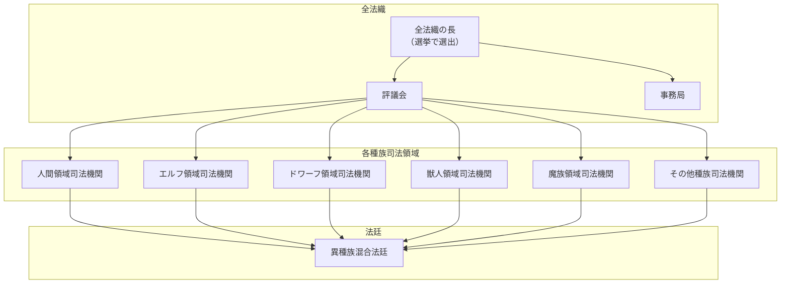
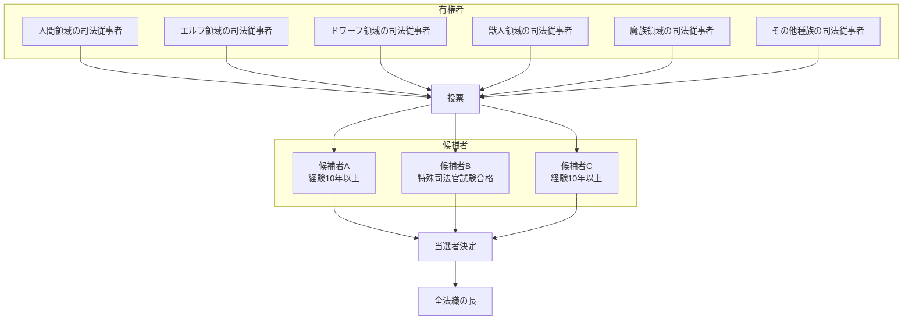
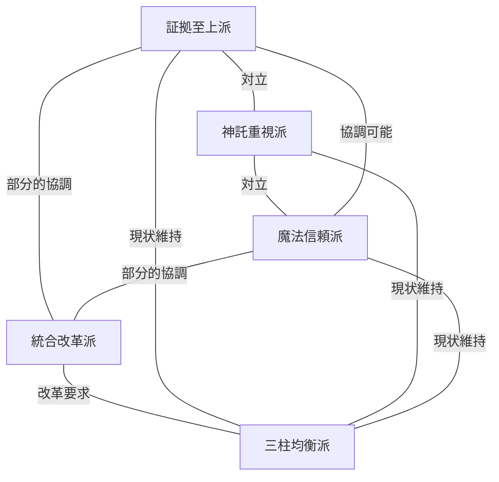
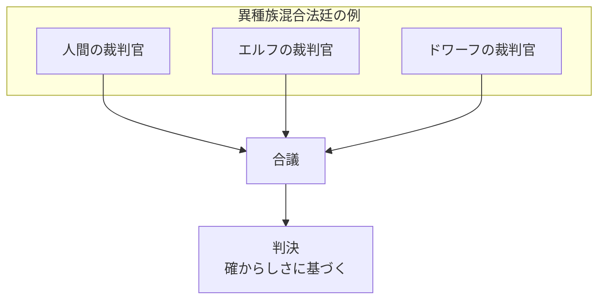

## 第4章：全法織

### 4.1 全法織とは

**全法織（ぜんほうしき）** は、異種族が共存する本世界において、各種族の司法制度を統合・調整する最高機関である。

|項目|内容|
|---|---|
|正式名称|全法織|
|読み方|ぜんほうしき|
|役割|各種族の司法制度を統合し、異種族間の裁判を管轄する|
|名称の由来|異なる種族の法を「織り上げる」という思想から|

### 4.2 名称に込められた思想

「全法織」という名称は、単なる「統一」や「統合」ではなく、**「織る」** という行為を選んでいる。

|概念|統一|織る|
|---|---|---|
|方法|異なるものを一つに均す|異なるものをそのまま組み合わせる|
|結果|差異の消失|差異を活かした新しい全体|
|本世界の選択|×|○|

各種族の法体系は**独自性を保ったまま**、全法織によって一枚の布のように織り合わされる。

---

### 4.3 組織構造

#### 4.3.1 全体図

#### 4.3.2 構成要素

|構成要素|役割|
|---|---|
|全法織の長|最高責任者。選挙により選出される|
|評議会|各種族の代表者による審議機関。政策決定を行う|
|事務局|実務を担当。裁判の調整、記録管理、人事など|
|各種族司法機関|各種族領域内の司法を管轄。全法織と連携する|
|異種族混合法廷|種族を超えた事件を裁く法廷。裁判官は異種族混合|

---

### 4.4 全法織の長

#### 4.4.1 選出方法

全法織の長は、**選挙**によって選出される。

| 項目   | 内容                               |
| ---- | -------------------------------- |
| 選挙周期 | 5年に1回                            |
| 有権者  | 司法従事者                            |
| 被選挙権 | 司法従事者としての実務経験10年以上、または特殊司法官試験合格者 |

#### 4.4.2 選挙の構造

#### 4.4.3 5年周期の意義

|周期|特徴|
|---|---|
|3年|短すぎる。政策実行前に選挙が来る|
|5年|方針を打ち出し、実行し、結果が見え始めたところで審判を受ける|
|10年|長すぎる。権力の固定化・腐敗リスク|

#### 4.4.4 国民の声の影響

建前上、有権者は司法従事者のみである。しかし実態として、司法従事者が所属する地域・種族の**国民の声**が投票行動に影響を与えることがある。

|建前|実態|
|---|---|
|司法従事者が純粋に司法的観点で投票|地元の声、種族の要望が投票先に影響する|
|政治的圧力とは無縁|非公式な間接民主制的要素が存在する|

---

### 4.5 派閥

#### 4.5.1 派閥の存在

全法織内には複数の**派閥**が存在する。派閥は三証明主義のどれを重視するか、司法制度をどう改革すべきかについて異なる立場を持つ。

#### 4.5.2 主要派閥

|派閥名|主張|主な支持層|
|---|---|---|
|証拠至上派|物理的証拠こそが司法の基盤。神託・魔法は補助に過ぎない|無神論者、合理主義者、人間の一部|
|神託重視派|神の言葉は最も確かな真実。神託証明の地位向上を|信仰深い種族、神官階級、伝統主義者|
|魔法信頼派|魔法的真実証明は直接的で信頼性が高い。技術の発展で限界を克服すべき|魔法使い、魔族、技術革新派|
|三柱均衡派|現行の三証明主義のバランスを維持すべき|現体制維持派、全法織主流派|
|統合改革派|被害者の信仰に依存しない新しい証明方法を模索すべき|学者、改革派、若手司法従事者|

#### 4.5.3 派閥間の関係

#### 4.5.4 派閥が選挙に与える影響

選挙では、各派閥が自派に近い候補者を支援する。

|影響|内容|
|---|---|
|候補者の派閥帰属|候補者は通常、いずれかの派閥に属している、または支援を受ける|
|選挙戦での対立|派閥間の政策論争が選挙の争点となる|
|裁判官の任命|当選した長の派閥が、裁判官人事に影響を与えうる|

---

### 4.6 派閥がもたらす問題

#### 4.6.1 評価のバイアス

派閥の存在は、特殊司法官試験の評価などにバイアスをもたらす。

|状況|発生しうるバイアス|
|---|---|
|神託重視派の評価者が証拠至上派的な判決を評価|「神託を軽視している」と低評価|
|証拠至上派の評価者が神託を重視した判決を評価|「非合理的である」と低評価|

#### 4.6.2 バイアスへの対応

**公式な対応策は存在しない。**

|建前|実態|
|---|---|
|評価は公正に行われる|バイアスは入る。防ぐ方法はない|
|複数の評価者によりバイアスが相殺される|評価者の派閥構成によっては偏りが生じる|

この現実を前提として、受験者や候補者は**派閥間のバランスを読みながら**行動することを求められる。

---

### 4.7 全法織と各種族の関係

#### 4.7.1 権限の分担

|事項|管轄|
|---|---|
|種族内の事件（人間同士、エルフ同士など）|各種族の司法機関|
|種族間の事件（人間vsエルフなど）|全法織・異種族混合法廷|
|司法制度の統一基準|全法織|
|各種族の法の独自発展|各種族の司法機関|

#### 4.7.2 異種族混合法廷の構成

異種族間の事件を裁く法廷では、裁判官が**異種族混合**で構成される。

#### 4.7.3 合議における種族間の視点差

|種族|重視しやすい傾向|
|---|---|
|人間|証拠主義、物理的時間|
|エルフ|神託証明、自然・森の神の意志|
|ドワーフ|物証、特に鉱物・工芸に関する専門知識|
|獣人|本能的直感、群れの論理|
|魔族|魔法的真実証明、魔術的因果関係|

これらの視点差を持つ裁判官が合議することで、多角的な「確からしさ」の判定が可能となる。

---

### 4.8 本章のまとめ

|項目|内容|
|---|---|
|全法織の役割|各種族の司法制度を織り合わせる最高機関|
|名称の思想|統一ではなく「織る」。差異を活かした統合|
|組織構成|長、評議会、事務局、各種族司法機関、異種族混合法廷|
|長の選出|5年ごとの選挙。有権者は司法従事者|
|国民の影響|非公式だが、司法従事者の投票行動に影響|
|派閥|証拠至上派、神託重視派、魔法信頼派、三柱均衡派、統合改革派|
|バイアス|存在する。防ぐ方法はない|
|異種族混合法廷|複数種族の裁判官が合議で判決を下す|

---
