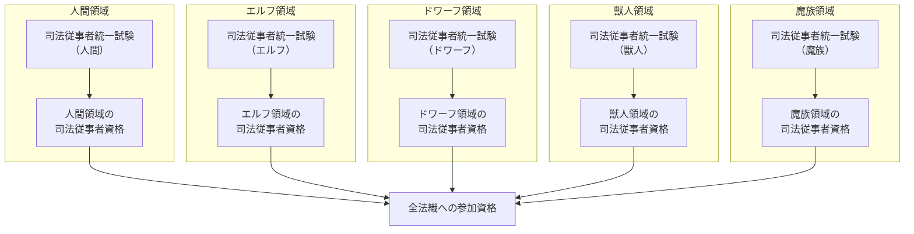
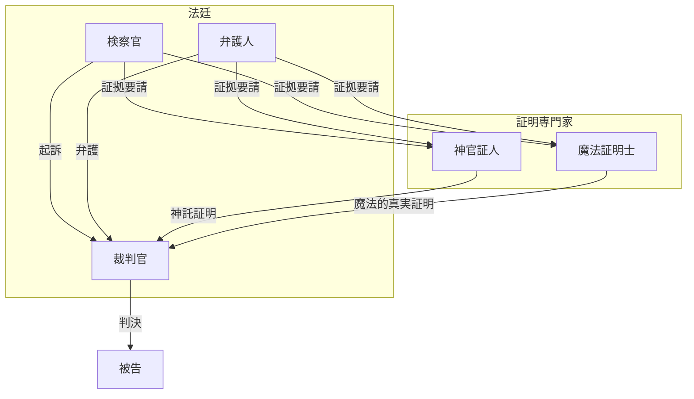
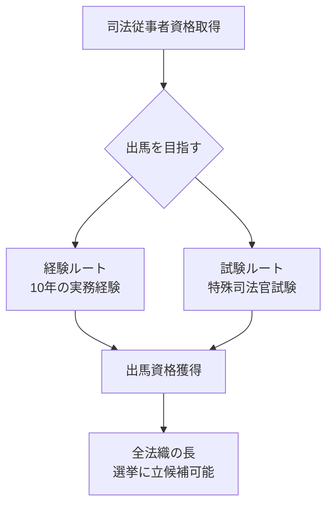
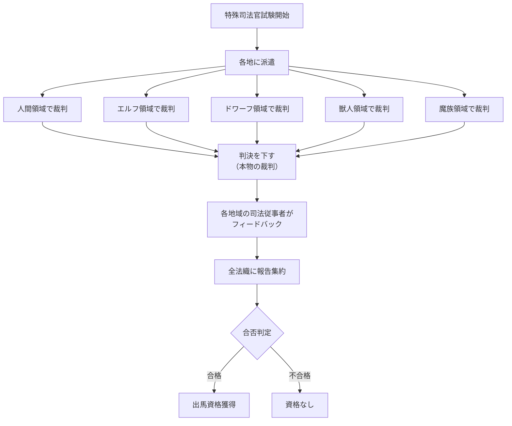
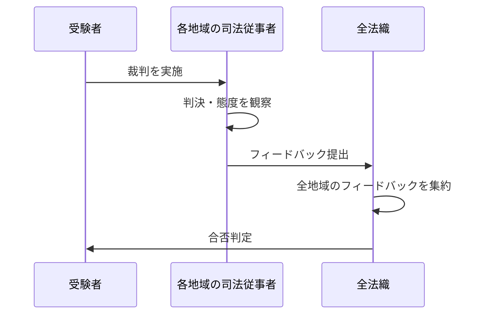
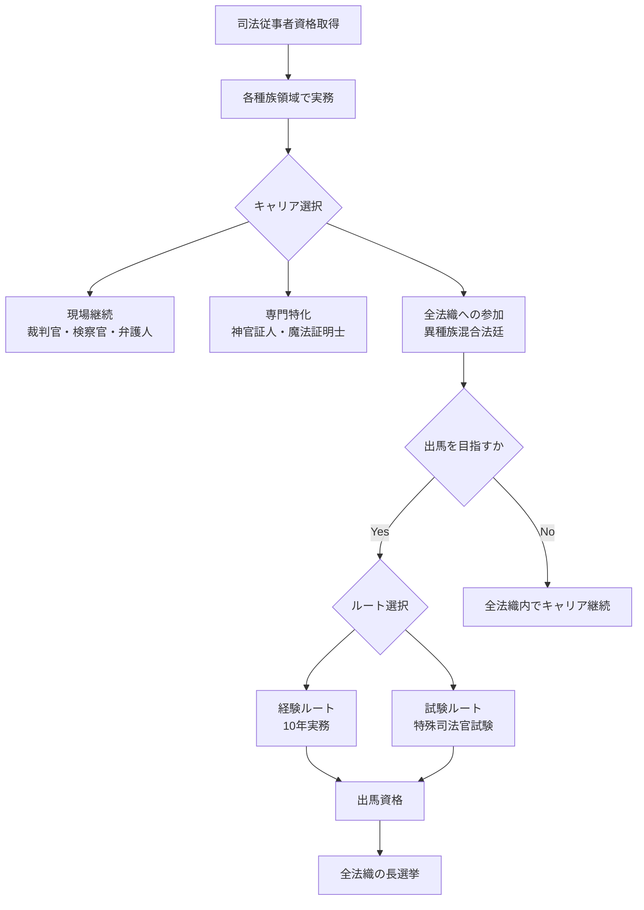

## 第5章：司法従事者制度

### 5.1 司法従事者とは

**司法従事者**とは、本世界の司法制度において裁判官、検察官、弁護人などの職務に従事する者の総称である。

|項目|内容|
|---|---|
|定義|司法に関わる職務を行う資格を持つ者|
|種族|全種族が司法従事者になりうる|
|資格取得|各種族の統一試験に合格する必要がある|

---

### 5.2 資格取得の体系

#### 5.2.1 各種族の統一試験

各種族は、それぞれの領域内で**統一された司法試験**を持っている。

#### 5.2.2 試験内容の種族間差異

各種族の試験は、共通の基盤を持ちながらも、種族固有の要素を含む。

|種族|共通要素|種族固有要素|
|---|---|---|
|人間|三証明主義、基本法理論、裁判手続|日本法を基盤とした法体系|
|エルフ|同上|森の法、自然神との関係、長寿命に関わる法的問題|
|ドワーフ|同上|鉱山法、工芸品の権利、地下領域の法|
|獣人|同上|群れの法、テリトリー権、狩猟に関する法|
|魔族|同上|魔術法、契約魔法の法的効力、魔力に関する権利|

---

### 5.3 司法従事者の職種

#### 5.3.1 主要な職種

|職種|役割|備考|
|---|---|---|
|裁判官|法廷を主宰し、判決を下す|異種族混合法廷では複数種族で構成|
|検察官|犯罪を捜査し、起訴する|三証明主義に基づく証拠収集|
|弁護人|被告の権利を守り、弁護する|集団罪回避などの戦略立案|
|神官証人|神託証明を行う|複数名による同時確認が必要|
|魔法証明士|魔法的真実証明を行う|現場再現の技術を持つ専門家|

#### 5.3.2 職種間の関係

---

### 5.4 全法織の長への出馬資格

#### 5.4.1 二つのルート

全法織の長に立候補するためには、以下の**いずれか**の条件を満たす必要がある。

|ルート|条件|想定される人物像|
|---|---|---|
|経験ルート|司法従事者として10年以上の実務経験|叩き上げ、現場を知るベテラン|
|試験ルート|特殊司法官試験に合格|理論派、天才型、若き俊英|

#### 5.4.2 二つのルートの比較

|項目|経験ルート|試験ルート|
|---|---|---|
|所要時間|最低10年|試験準備期間＋1年の試験期間|
|強み|現場経験、実務感覚、人脈|理論的知識、多種族法廷の経験、突破力|
|弱み|特定領域に偏る可能性|現場経験の浅さを指摘されることも|
|派閥からの見方|「地道に積み上げた信頼」|「厳しい試験を突破した実力」|

#### 5.4.3 ルート間の対立

二つのルートの存在は、司法従事者間に対立構造を生むことがある。

|経験ルート組の主張（典型的な発言例）|試験ルート組の主張（典型的な発言例）|
|---|---|
|「法廷は理論じゃない」|「10年ダラダラやっただけの者と一緒にするな」|
|「現場の肌感覚が重要だ」|「全法体系を理論的に理解している」|
|「試験だけで上がってきた奴に何がわかる」|「経験だけでは偏りが生じる」|

---

### 5.5 特殊司法官試験

#### 5.5.1 概要

**特殊司法官試験**は、10年の経験なしで全法織の長への出馬資格を得るための試験である。通常の司法試験とは全く異なる、極めて過酷な内容となっている。

|項目|内容|
|---|---|
|試験期間|1年間|
|試験内容|各地を飛び回り、実際の裁判で判決を下す|
|特徴|模擬ではなくガチの裁判。実地で学ぶ|

#### 5.5.2 試験の実態

#### 5.5.3 評価項目

受験者は以下の項目で評価される。

| 評価項目       | 測定するもの     | 失敗時の印象             |
| ---------- | ---------- | ------------------ |
| 判決の妥当性     | 法的判断力      | 「法律を理解していない」       |
| 上訴されなかった件数 | 判決の説得力・納得感 | 「不服だらけの判決」         |
| 受験者が棄却した回数 | 案件の見極め力    | 「裁判にすべきでないものを受理した」 |
| 冤罪回数       | 致命的ミス      | **一発アウト級**         |
| 冤罪未遂回数     | 危うさの頻度     | 「危なっかしい」           |
| 三証明主義の運用   | 技術的習熟度     | 「道具を使いこなせていない」     |
| 苦情の有無      | 対人能力・信頼性   | 「種族間調整ができない」       |

#### 5.5.4 評価の仕組み

|段階|内容|
|---|---|
|1|受験者が各地域で裁判を行う|
|2|その地域の司法従事者がフィードバックを作成|
|3|フィードバックが全法織に送られる|
|4|全法織が全てのフィードバックを集約し、正式な評価を下す|

#### 5.5.5 評価におけるバイアス

評価者である各地域の司法従事者には**派閥**がある。そのため、評価にはバイアスが入りうる。

|状況|起こりうること|
|---|---|
|神託重視派の評価者 vs 証拠至上派的な受験者|「神託を軽視している」と低評価|
|証拠至上派の評価者 vs 神託重視派的な受験者|「非合理的」と低評価|
|受験者が将来有望と判断された場合|恩を売るために高評価、または芽を摘むために低評価|

**公式なバイアス防止策は存在しない。**

受験者は、バイアスの嵐の中で1年間を生き延びる必要がある。逆に言えば、合格者は**どの派閥からも一定の評価を得られた者**であり、その政治的生存能力も証明されている。

#### 5.5.6 試験の過酷さ

|側面|内容|
|---|---|
|責任の重さ|模擬ではなく本物。誤判すれば無実の者が罰を受ける|
|多様性への対応|各種族の法感覚が異なる中で成果を出す必要がある|
|監視の圧力|1年間、どこに行っても評価者に見られている|
|政治的立ち回り|派閥バイアスを読みながら行動する必要がある|

---

### 5.6 司法従事者のキャリアパス

#### 5.6.1 一般的なキャリア

#### 5.6.2 キャリアにおける派閥の影響

|キャリア段階|派閥の影響|
|---|---|
|資格取得時|比較的影響は小さい。試験は公正に行われる|
|実務経験中|所属領域・上司の派閥が影響。人脈形成に影響|
|全法織参加時|派閥への帰属・協力関係が重要になる|
|特殊司法官試験|評価者の派閥バイアスを受ける|
|選挙出馬時|派閥の支援が当落を左右する|

---

### 5.7 本章のまとめ

|項目|内容|
|---|---|
|司法従事者|司法に関わる職務を行う資格を持つ者。全種族がなりうる|
|資格取得|各種族の統一試験に合格する必要がある|
|職種|裁判官、検察官、弁護人、神官証人、魔法証明士など|
|出馬資格|経験10年以上、または特殊司法官試験合格|
|特殊司法官試験|1年間、各地で本物の裁判を行い評価される|
|評価項目|判決妥当性、上訴件数、冤罪回数、三証明主義運用など|
|評価者|各地域の司法従事者。フィードバックが全法織に集約|
|バイアス|存在する。防ぐ方法はない|

---
