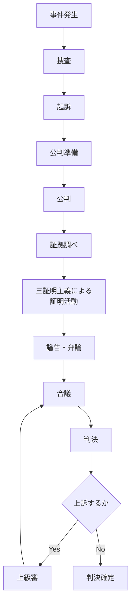
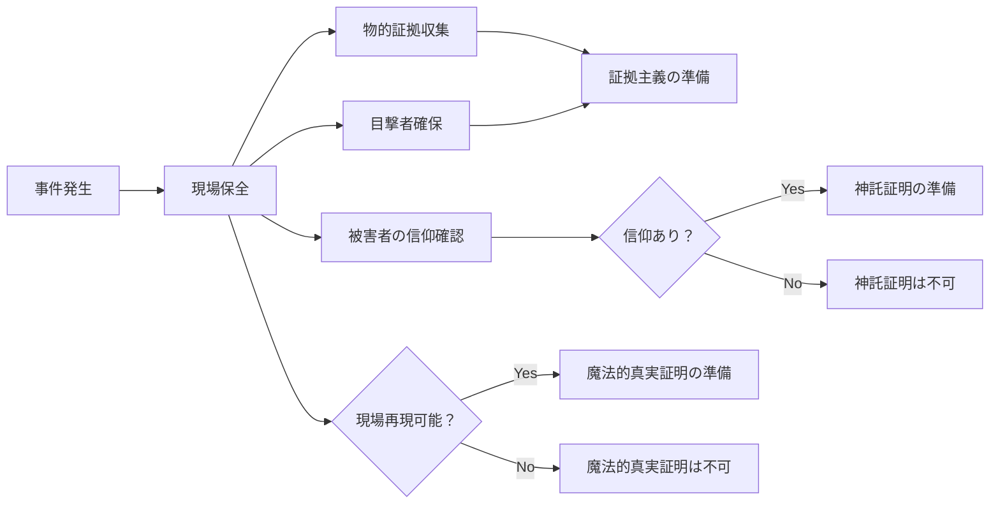
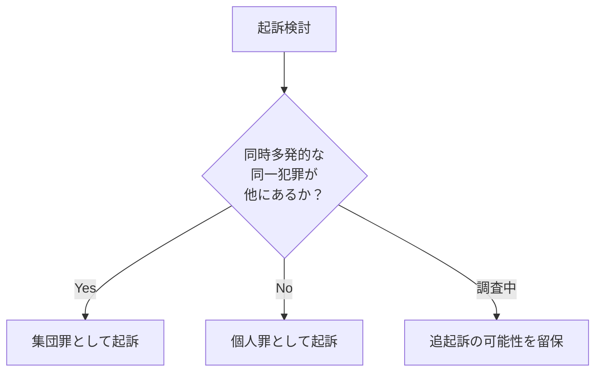
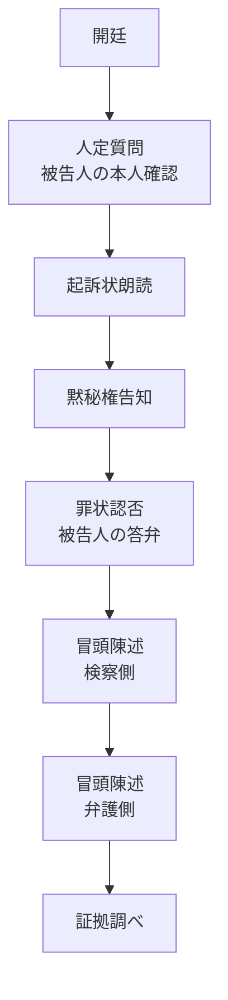
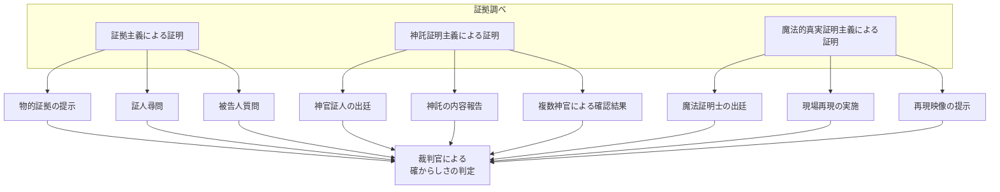
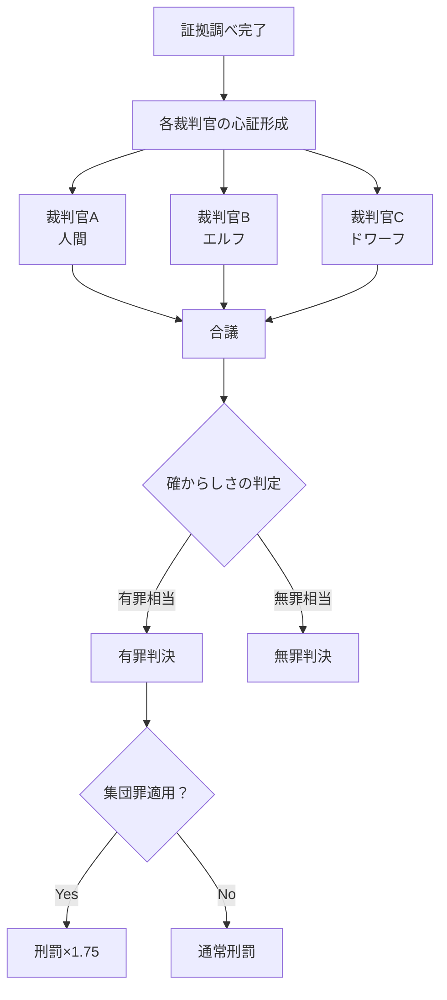
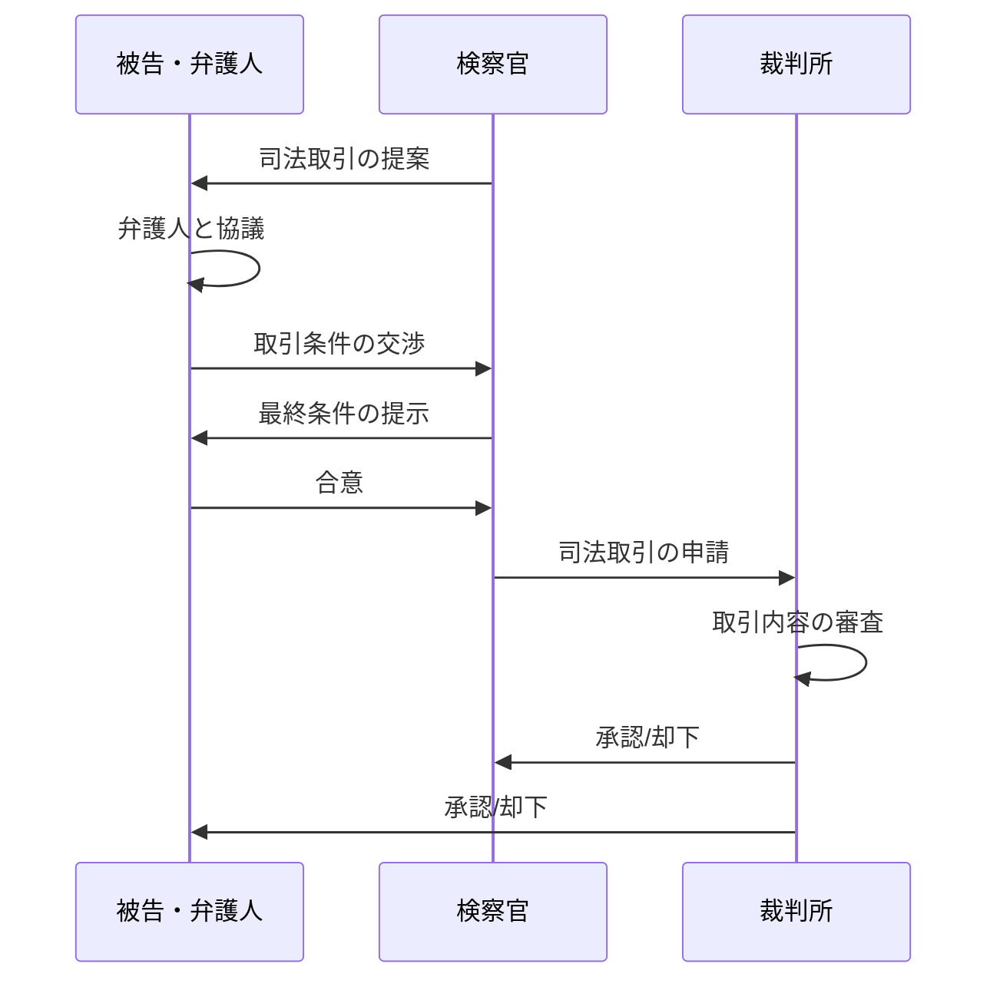
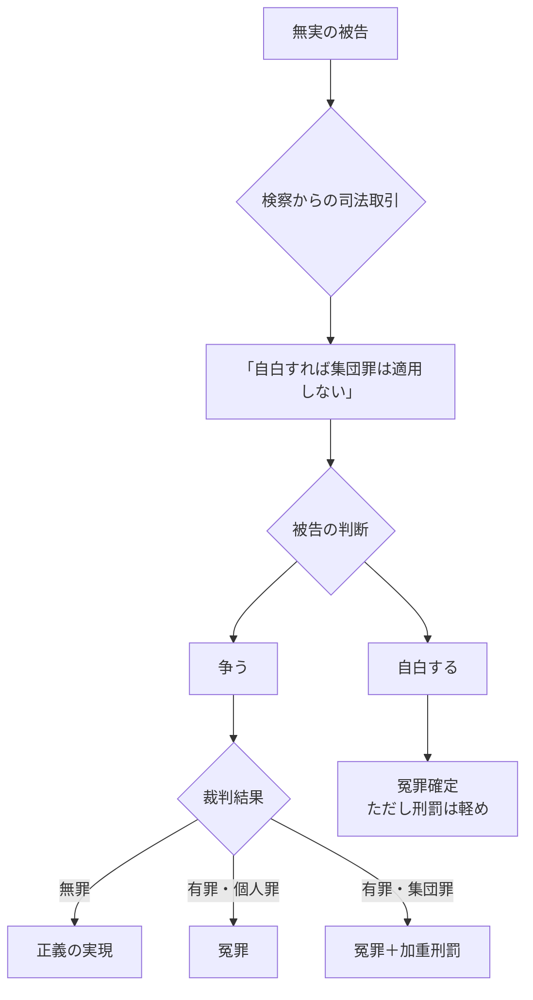
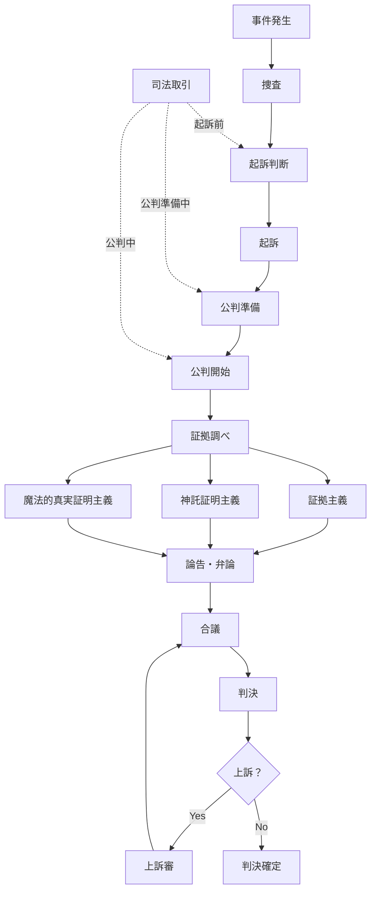

## 第6章：裁判の流れ

### 6.1 裁判の基本原則

本世界の裁判は、以下の基本原則に基づいて運営される。

|原則|内容|
|---|---|
|確からしさ基準|絶対的真実ではなく「確からしさ」に基づいて判決を下す|
|三証明主義|証拠・神託・魔法的真実の三方向から事実を追求する|
|異種族混合|種族間事件では複数種族の裁判官が合議する|
|個人責任|罪は個人に帰属し、種族や血縁への連座はない|
|公開原則|裁判は原則として公開で行われる|

---

### 6.2 裁判の全体フロー

---

### 6.3 各段階の詳細

#### 6.3.1 捜査段階

|項目|内容|
|---|---|
|担当|検察官および捜査機関|
|目的|犯罪事実の解明、証拠収集|
|三証明への準備|物的証拠の確保、神官への啓示確認依頼、現場保全（魔法的証明用）|

**捜査段階での重要判断：**

|判断事項|影響|
|---|---|
|被害者の信仰の有無|神託証明が使えるかどうかが決まる|
|現場の保全状態|魔法的真実証明が使えるかどうかが決まる|
|同時多発性の確認|集団罪の適用可能性を検討する|

#### 6.3.2 起訴段階

|項目|内容|
|---|---|
|担当|検察官|
|判断内容|起訴するか、不起訴とするか|
|起訴状の内容|罪名、犯罪事実、適用法条、集団罪の主張（該当する場合）|

**集団罪の起訴判断：**

#### 6.3.3 公判準備段階

|項目|内容|
|---|---|
|目的|争点の整理、証拠の事前開示、証人の確定|
|検察側の準備|三証明それぞれの証拠リスト作成|
|弁護側の準備|反証の準備、証明方法への異議申立ての検討|

**使用する証明方法の確定：**

|証明方法|使用可否の確認事項|
|---|---|
|証拠主義|常に使用可能|
|神託証明主義|被害者の信仰確認、神官証人の手配|
|魔法的真実証明主義|現場再現の可否、魔法証明士の手配|

#### 6.3.4 公判段階

公判は以下の順序で進行する。

---

### 6.4 証拠調べと三証明主義

#### 6.4.1 証拠調べの構造

証拠調べでは、三証明主義に基づき、最大三種類の証明活動が行われる。

#### 6.4.2 各証明の実施手順

**証拠主義による証明：**

|順序|内容|
|---|---|
|1|物的証拠の提示（凶器、遺留品、記録など）|
|2|証人尋問（目撃者、関係者）|
|3|被告人質問|
|4|論理的推論による因果関係の構築|

**神託証明主義による証明：**

|順序|内容|
|---|---|
|1|被害者の信奉する神の確認|
|2|神官証人Aによる啓示内容の報告|
|3|神官証人B、C、D…による同時確認結果の報告|
|4|啓示内容の解釈と法廷への適用|

**魔法的真実証明主義による証明：**

|順序|内容|
|---|---|
|1|現場再現の条件確認|
|2|魔法証明士による再現の実施|
|3|「何が起きたか」の映像提示|
|4|弁護側・検察側による映像の解釈主張|

#### 6.4.3 証明方法間の優先順位の適用

|状況|処理|
|---|---|
|三証明が一致|高い確からしさとして採用|
|証拠主義と副次証明が矛盾|原則として証拠主義を優先。ただし副次証明が極めて強力な場合は考慮|
|神託と魔法的真実が矛盾|両方を副次的証拠として併記し、証拠主義で補完を試みる|
|いずれの証明も不十分|「確からしさ」が低いとして、無罪方向に傾く|

---

### 6.5 論告・弁論

証拠調べの後、検察側と弁護側がそれぞれの主張をまとめる。

|段階|担当|内容|
|---|---|---|
|論告|検察官|証拠に基づく有罪の主張、求刑|
|弁論|弁護人|無罪または減刑の主張|
|最終陳述|被告人|被告人自身の最後の言葉|

**論告における集団罪の主張例：**

|検察側主張|内容|
|---|---|
|同一性|「被告の罪はAと同じ『森の神木毀損罪』である」|
|複数性|「被告とAの2名が本罪を犯している」|
|同時多発性|「物理的時間において、両者の犯行は同一週内に発生した」|
|求刑|「よって集団罪を適用し、通常刑の1.75倍を求刑する」|

**弁論における集団罪回避の主張例：**

|弁護側主張|内容|
|---|---|
|時間差|「依頼人の犯行はAより7日後であり、同時多発ではない」|
|罪名の差異|「依頼人の行為は『神木毀損』ではなく『森林軽微損壊』である」|
|物理的時間の強調|「副次的証明ではなく、物理的時間を基準とすべき」|

---

### 6.6 合議と判決

#### 6.6.1 合議の構造

異種族混合法廷では、複数種族の裁判官が合議により判決を決定する。

#### 6.6.2 確からしさの判定

判決は「確からしさ」に基づいて下される。絶対的真実の証明は要求されない。

|確からしさの程度|判決|
|---|---|
|高い|有罪|
|中程度|状況により判断（追加証拠を求める場合も）|
|低い|無罪|

**確からしさを高める要素：**

|要素|効果|
|---|---|
|三証明が一致|大きく高まる|
|二証明が一致、一証明が使用不可|中程度に高まる|
|物的証拠が明確|高まる|
|自白がある|高まる（ただし自白のみでは不十分）|
|複数の目撃証言が一致|高まる|

#### 6.6.3 判決の種類

| 判決      | 内容                     |
| ------- | ---------------------- |
| 有罪（個人罪） | 通常刑罰を科す                |
| 有罪（集団罪） | 通常刑罰×1.75を科す           |
| 無罪      | 被告人を釈放する               |
| 棄却      | 訴訟要件の欠如等により審理に入らず終了させる |

---

### 6.7 司法取引

#### 6.7.1 司法取引の概要

本世界では、検察と被告の間で**司法取引**が認められている。

|項目|内容|
|---|---|
|定義|被告が一定の協力をする代わりに、検察が起訴内容や求刑を軽減する合意|
|時期|起訴前、公判中、いずれも可能|
|法的効力|裁判所の承認を得て成立|

#### 6.7.2 司法取引の類型

|類型|内容|被告のメリット|検察のメリット|
|---|---|---|---|
|集団罪回避|自白と引き換えに集団罪適用を見送る|刑罰が1.0倍で済む|確実な有罪獲得|
|刑罰軽減|共犯者情報提供と引き換えに減刑|刑罰軽減|他の犯罪者の検挙|
|罪名変更|自白と引き換えに軽い罪で起訴|より軽い罪名|裁判の迅速化|

#### 6.7.3 司法取引のフロー

#### 6.7.4 司法取引と冤罪

司法取引は冤罪を生む要因となりうる。

|状況|冤罪発生のメカニズム|
|---|---|
|証拠不十分だが状況証拠あり|被告が「争っても勝てない」と判断し、無実でも自白|
|集団罪のリスク|1.75倍の刑罰を恐れ、やっていなくても認める|
|長期裁判の負担|争い続ける経済的・精神的負担に耐えられず妥協|

---

### 6.8 上訴制度

#### 6.8.1 上訴の概要

判決に不服がある場合、上級審に上訴することができる。

|項目|内容|
|---|---|
|上訴権者|被告人、検察官|
|上訴理由|事実誤認、法令違反、量刑不当など|
|上訴期限|判決から一定期間内|

#### 6.8.2 上訴審での再判定

|審査内容|詳細|
|---|---|
|三証明の再評価|一審での証明活動が適切だったかを審査|
|確からしさの再判定|一審の判定が妥当だったかを審査|
|集団罪適用の妥当性|同時多発性の判定が正しかったかを審査|

---

### 6.9 裁判の全体像

---

### 6.10 本章のまとめ

|項目|内容|
|---|---|
|基本原則|確からしさ基準、三証明主義、異種族混合、個人責任、公開原則|
|裁判の流れ|捜査→起訴→公判準備→公判→証拠調べ→論告弁論→合議→判決|
|証拠調べ|三証明主義に基づき最大三種類の証明活動を実施|
|確からしさ|絶対的真実ではなく「確からしさ」で判決。三証明の一致で高まる|
|合議|異種族混合の裁判官が合議で判決を決定|
|司法取引|存在する。集団罪回避、刑罰軽減などの類型|
|冤罪|司法取引、確からしさ基準により発生しうる|
|上訴|判決に不服があれば上級審に上訴可能|

---
