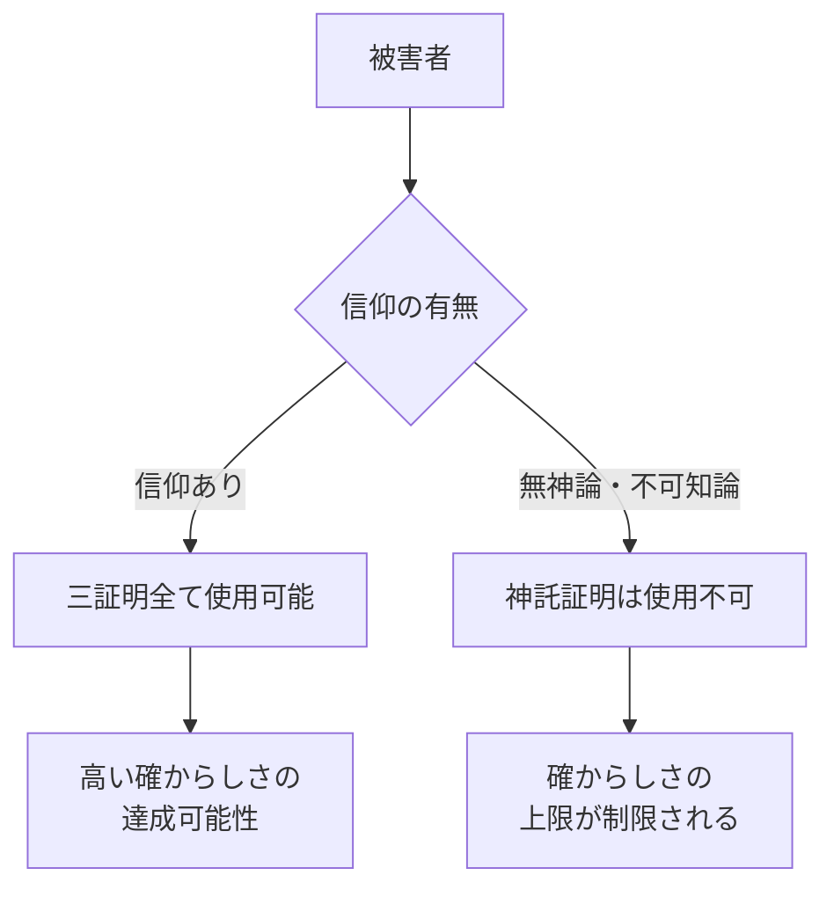
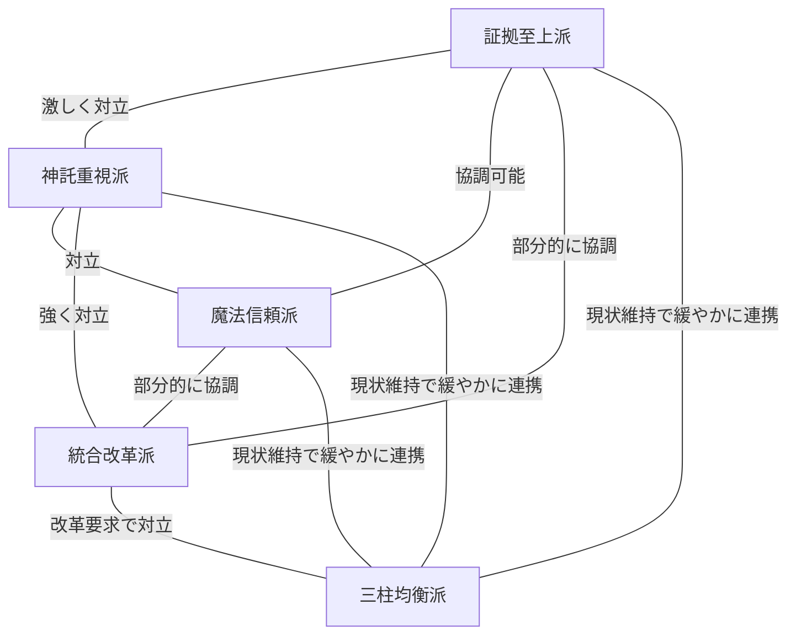
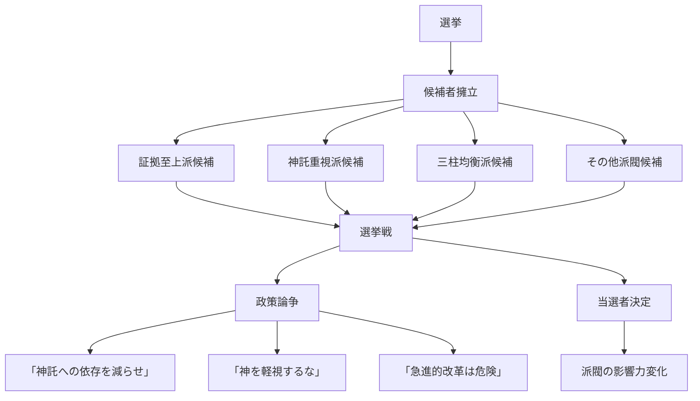
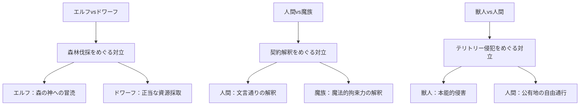
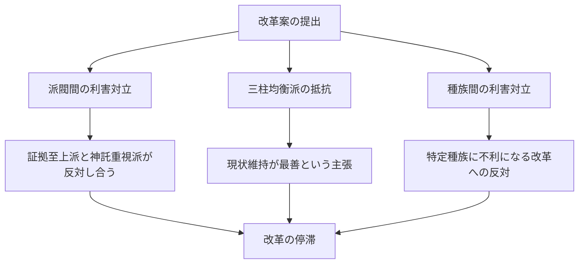
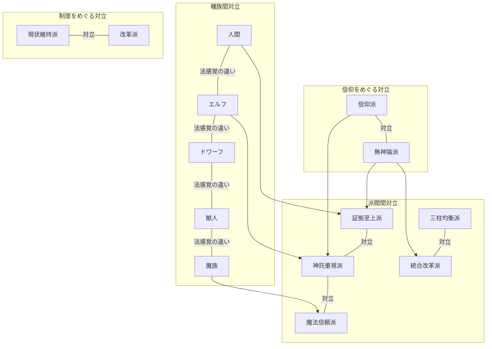

## 第7章：社会的対立と派閥

### 7.1 概要

本世界の司法制度は、異なる種族、異なる信仰、異なる価値観を持つ者たちを一つの法体系の下に統合している。この統合は「織り合わせる」という思想に基づいているが、それゆえに多くの**社会的対立**を内包している。

対立は否定されるべきものではなく、むしろ**司法制度が健全に機能するための原動力**として存在している。

|対立の種類|内容|
|---|---|
|信仰に関する対立|信仰派 vs 無神論派|
|証明方法に関する対立|三証明主義のどれを重視するか|
|派閥間の対立|全法織内の政治的対立|
|種族間の対立|法感覚の違いに起因する摩擦|
|制度に関する対立|現状維持派 vs 改革派|

---

### 7.2 信仰に関する対立

#### 7.2.1 対立の構造

本世界には**信仰を持つ者**と**持たない者**が共存している。この違いは、神託証明主義の適用可否に直接影響するため、司法において重大な意味を持つ。

#### 7.2.2 信仰派の主張

|主張|内容|
|---|---|
|神託の正当性|神託証明は神聖な真実への道であり、最も信頼できる|
|自己責任論|無神論者が被害者の場合、正義の追求が不完全になるのは本人の選択の結果|
|制度の正当性|現行制度は信仰を持つ多数派のために設計されており、問題はない|

#### 7.2.3 無神論派の主張

|主張|内容|
|---|---|
|神託への懐疑|神託証明は解釈の余地が多すぎて曖昧。むしろ確からしさを下げている|
|公正性の要求|被害者の信仰に関わらず、同等の司法サービスを受ける権利がある|
|証拠主義の優位|証拠主義と魔法的真実証明だけの方がよほど公正で合理的|

#### 7.2.4 対立が法廷に現れる場面

|場面|内容|
|---|---|
|被害者が無神論者の事件|「神託証明が使えないことで正義が不完全になる」という議論|
|被告が信仰者で被害者が無神論者|「被告には三証明全てで裁かれる権利がある」という弁護戦略|
|神託の解釈が争われる事件|「神託は曖昧すぎる」vs「神の言葉を疑うのか」|

---

### 7.3 全法織内の派閥

#### 7.3.1 五大派閥

全法織内には、三証明主義のどれを重視するか、制度をどう改革すべきかについて異なる立場を持つ**五つの主要派閥**が存在する。

|派閥名|中心主張|主な支持層|
|---|---|---|
|証拠至上派|物理的証拠こそが司法の基盤|無神論者、合理主義者、人間の一部|
|神託重視派|神の言葉は最も確かな真実|信仰深い種族、神官階級、伝統主義者|
|魔法信頼派|魔法的真実証明の技術発展を推進|魔法使い、魔族、技術革新派|
|三柱均衡派|現行バランスを維持すべき|現体制維持派、全法織主流派|
|統合改革派|信仰に依存しない新証明方法を模索|学者、改革派、若手司法従事者|

#### 7.3.2 派閥間の関係図

#### 7.3.3 各派閥の詳細

**証拠至上派**

|項目|内容|
|---|---|
|中心思想|再現可能で論理的な証拠こそが司法の基盤|
|神託への態度|補助的なものとして認めるが、重視しない|
|魔法的真実への態度|有用だが、論理性の欠如が問題|
|政策目標|証拠主義の基礎的地位の強化|
|弱点|物証がない事件への対応が弱い|

**神託重視派**

|項目|内容|
|---|---|
|中心思想|神の言葉は人間の証拠より確かな真実|
|証拠への態度|人が捏造できるものとして、過度な信頼を戒める|
|魔法的真実への態度|神聖さに欠けるが、補助としては認める|
|政策目標|神託証明の地位向上、神官の権限拡大|
|弱点|無神論者の被害者を軽視しているという批判|

**魔法信頼派**

|項目|内容|
|---|---|
|中心思想|「何が起きたか」を直接見せる魔法は最も説得力がある|
|証拠への態度|論理的だが、間接的すぎる|
|神託への態度|曖昧で解釈に依存しすぎる|
|政策目標|魔法的真実証明の技術発展、現場再現制約の緩和|
|弱点|論理性の欠如という根本的問題|

**三柱均衡派**

|項目|内容|
|---|---|
|中心思想|三証明はそれぞれの弱点を補い合う現行バランスが最善|
|他派閥への態度|急進的な変更に反対し、穏健な調整を支持|
|政策目標|現行制度の維持と微調整|
|強み|全法織の主流派として安定した支持基盤|
|弱点|改革派から「現状維持に固執している」と批判|

**統合改革派**

|項目|内容|
|---|---|
|中心思想|被害者の信仰に依存しない、第四の証明方法を模索すべき|
|他派閥への態度|現状の三証明主義には構造的欠陥がある|
|政策目標|新しい証明方法の研究・開発|
|支持層|若手、学者、理想主義者|
|弱点|具体的な代替案がまだ確立されていない|

---

### 7.4 派閥対立の影響

#### 7.4.1 選挙への影響

全法織の長を選ぶ選挙では、派閥間の対立が前面に出る。

#### 7.4.2 人事への影響

|影響を受ける人事|内容|
|---|---|
|裁判官の任命|長の派閥が任命権を持ち、同派閥の者が優遇される傾向|
|評議会の構成|派閥間のバランスが政治的に調整される|
|特殊司法官試験の評価|評価者の派閥がバイアスとして作用|

#### 7.4.3 裁判への影響

|影響|内容|
|---|---|
|裁判官の構成|特定派閥に偏った構成になる可能性|
|証明方法の重み付け|裁判官の派閥によって三証明の重視度が異なる|
|判決の傾向|同じ事件でも裁判官の構成で判決が変わりうる|

**例：同一事件での派閥による判断差**

|派閥構成|傾向|
|---|---|
|証拠至上派が多い法廷|物的証拠を重視、神託は補助扱い|
|神託重視派が多い法廷|神託を重視、物証の欠如を神託で補おうとする|
|三柱均衡派が多い法廷|三証明のバランスを取ろうとする|

---

### 7.5 種族間の対立

#### 7.5.1 法感覚の違い

各種族は、歴史・文化・生態の違いから、異なる**法感覚**を持っている。

|種族|法感覚の特徴|
|---|---|
|人間|証拠主義的、物理的時間を重視、成文法志向|
|エルフ|神託・自然法を重視、長期的視点、森の法|
|ドワーフ|物証重視、契約の厳格性、鉱山・工芸の専門法|
|獣人|群れの論理、テリトリー意識、本能的正義感|
|魔族|魔法的因果関係を重視、契約魔法の法的効力|

#### 7.5.2 種族間対立の例

#### 7.5.3 異種族混合法廷の意義

種族間の法感覚の違いがあるからこそ、**異種族混合法廷**が重要になる。

|意義|内容|
|---|---|
|多角的視点|単一種族では見落とす観点を補完|
|正当性の担保|特定種族に有利な判決という批判を防ぐ|
|相互理解の促進|合議を通じて種族間の法感覚の違いを学ぶ|

---

### 7.6 改革をめぐる対立

#### 7.6.1 主な改革議論

|議論|現状維持派の主張|改革派の主張|
|---|---|---|
|神託証明の扱い|伝統的に重要な役割を果たしてきた|無神論者への不公正を解消すべき|
|第四の証明方法|現行三証明で十分、新技術は不安定|信仰に依存しない証明が必要|
|集団罪の閾値|2名で適切、社会的影響を考慮|厳しすぎる、3名以上に引き上げるべき|
|1.75倍の係数|理論的根拠がある|重すぎる、1.5倍に引き下げるべき|

#### 7.6.2 改革が進まない理由

---

### 7.7 対立の存在意義

#### 7.7.1 なぜ対立は必要か

|理由|内容|
|---|---|
|権力の抑制|単一派閥の独裁を防ぐ|
|多様性の維持|異なる視点が司法の質を高める|
|自己修正機能|対立を通じて制度の問題点が明らかになる|
|正当性の基盤|議論を経た決定は正当性を持つ|

#### 7.7.2 対立がないと起きる問題

|問題|内容|
|---|---|
|偏った司法|特定の価値観だけが正義とされる|
|腐敗の進行|批判がなければ権力は腐敗する|
|少数者の排除|多数派の論理だけがまかり通る|
|制度の硬直化|改革の議論が起きず、時代に合わなくなる|

---

### 7.8 対立の全体像

---

### 7.9 本章のまとめ

|項目|内容|
|---|---|
|対立の種類|信仰、証明方法、派閥、種族、制度改革|
|信仰の対立|信仰派vs無神論派。神託証明の適用可否に影響|
|五大派閥|証拠至上派、神託重視派、魔法信頼派、三柱均衡派、統合改革派|
|派閥の影響|選挙、人事、裁判の判決に影響|
|種族間対立|法感覚の違いから生じる摩擦|
|改革の停滞|派閥・種族の利害対立により進みにくい|
|対立の意義|権力抑制、多様性維持、自己修正機能|

---
